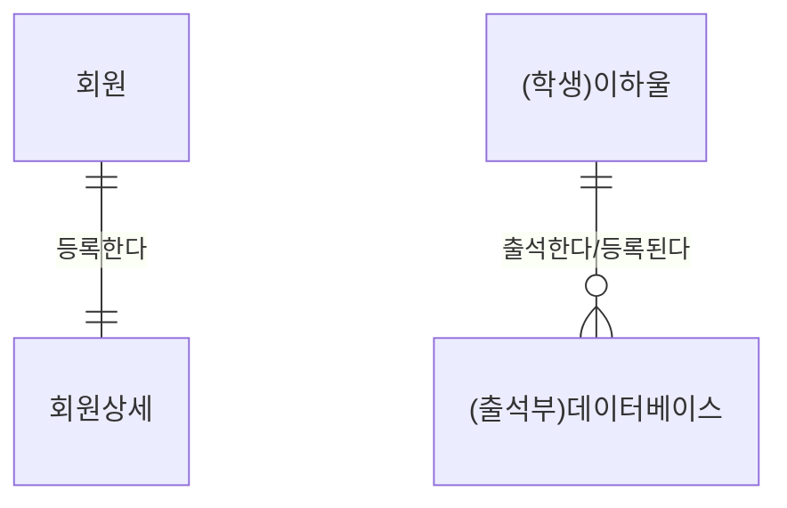
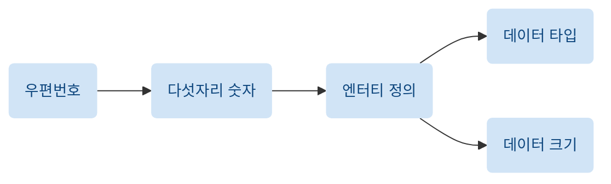
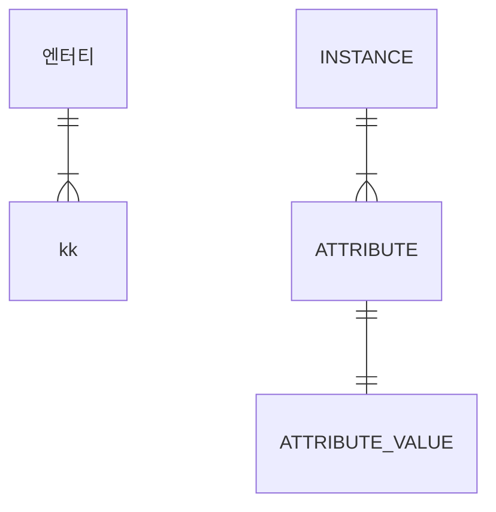
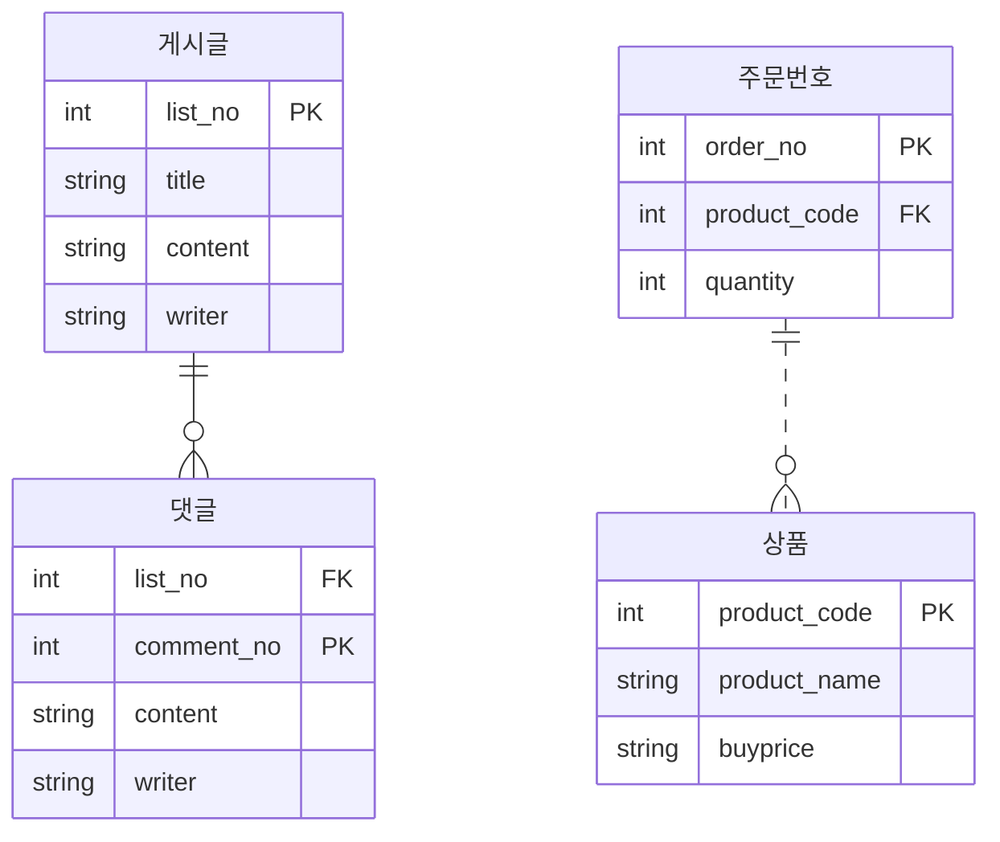
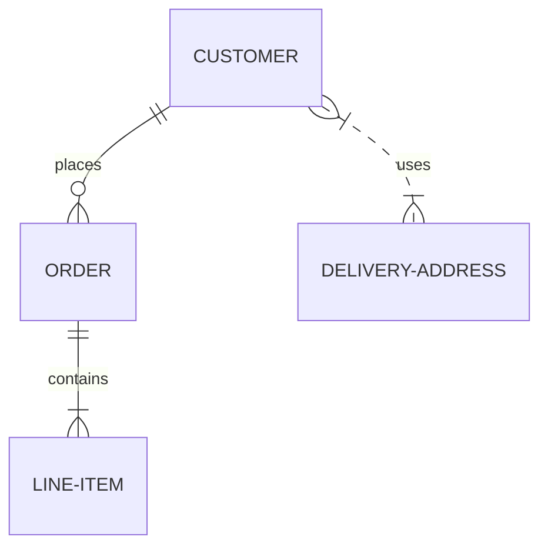
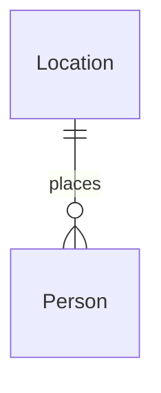

* 설치 참고 : <https://frhyme.github.io/mermaid/Embedding_mermaid_in_github_page/>

* 문법 참고 :
* https://minhan2.tistory.com/entry/Markdown-mermaid-%ED%83%80%EC%9E%85-%EC%A2%85%EB%A5%98
* https://sabarada.tistory.com/210
* https://www.jeong-min.com/47-mermaid/

# 머메이드 드로잉 페이지

