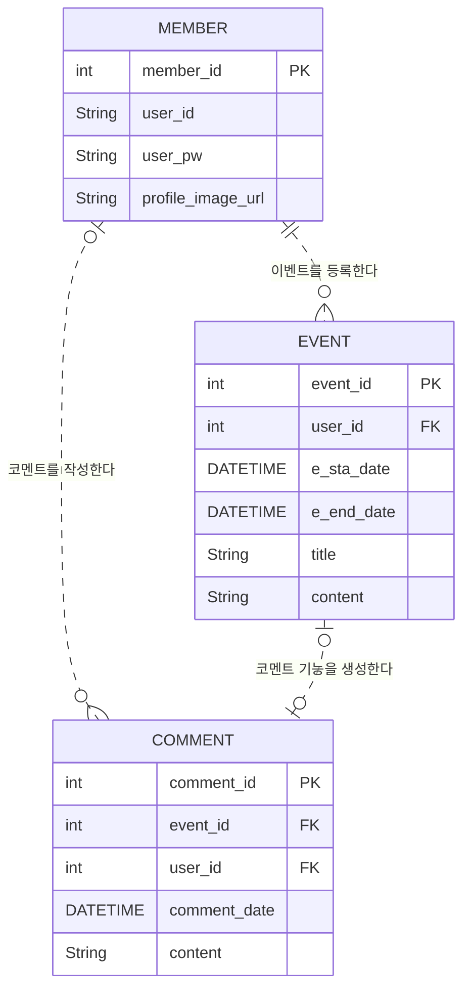

```
    "EVENT_CONTENT" {
        INT content_id PK
        String content
    }

```


|           사용자           |           개발자           |
|:-----------------------:|:-----------------------:|
| 현재 날짜로 달력이 보임<br>일정은 없음 | 현재 날짜로 달력을 출력<br> 일정은 없음 |
|          로그인한다          |                         |
|        내 일정이 보임         |                         |


* 유저가 로그인한다.
* 현재 날짜로 달력이 나오되 유저가 작성한 일정이 나온다.
* 등록할 날짜를 선택한다.

* 유저가 입력한 날짜를 찾는다.
* 해당 날짜의 일정을 모두 찾는다. 
* 타임순으로 정렬한다.


DATE 현재 연+월 에 에서 

