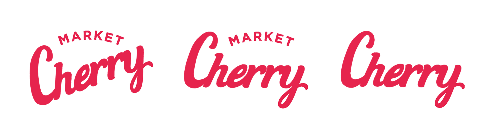

### 체리 브랜드 로고안 - 1차 논의
    

* 기본 폰트와 컬러를 다양화 -> 2차 도안
* 2차 도안을 기준으로 -> 

* 데이터 모델링 개념 참조 링크
 * https://inpa.tistory.com/entry/DB-%F0%9F%93%9A-%EB%8D%B0%EC%9D%B4%ED%84%B0-%EB%AA%A8%EB%8D%B8%EB%A7%81-1N-%EA%B4%80%EA%B3%84-%F0%9F%93%88-ERD-%EB%8B%A4%EC%9D%B4%EC%96%B4%EA%B7%B8%EB%9E%A8

* 정규화과정
  * 세분화해서 나누고 중복을 제거
  
* 반정규화
  * 성능이슈가 생기면 진행 거의하지는 않음
  

* 다같이 DB 설계를 하는 과정
  * 담당 팀원과 의논
  * 마이페지의 경우 각 담당 팀원 참여가 요구됨
  

* 갱신 이상 / 삭제 이상 / 삽입 이상(Anomaly)

* 스프링 시큐리티 암호화기능
    * https://docs.spring.io/spring-security/reference/features/authentication/password-storage.html#authentication-password-storage-bcrypt

* 쿠폰/적립금
* DB 구성만 잘하면 구현은 어렵지 않다.

* 상태 관리는 JWT 토큰를 사용해보는 것으로 고려
  * 스프링 시큐리티에 있음
  * 액세스토큰 검증을 하고 
  * 리프레쉬 토큰을 다시
  * 리프레쉬까지 만료되면 다시 로그인
  * https://inpa.tistory.com/entry/WEB-%F0%9F%93%9A-JWTjson-web-token-%EB%9E%80-%F0%9F%92%AF-%EC%A0%95%EB%A6%AC

    
* 회원 탈퇴
  * 소프트딜리트 : 바로 지우지 않는 것, 어딘가에는 보관
  * 하드 딜리트 : 컬럼을 지워버린 것

* 상태 코드
  * 이력 관리

* 제외 항목    
  * 상품 맨 위에 안함 ( 신상품/베스트/알뜰쇼핑/특가,혜택)
  * 선물내역, 컬리페이, 나의컬리스타일
  * 카테고리를 세분화
  * 마이페이지 / 컬리 퍼플 박스  / 나의 컬리 스타일

