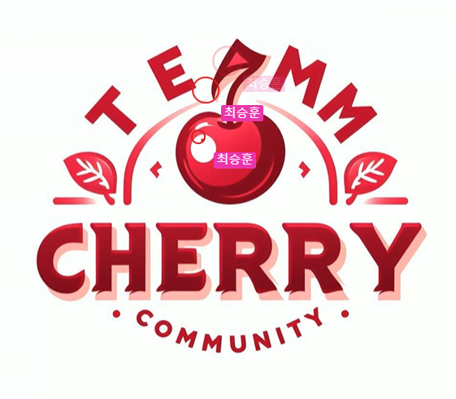
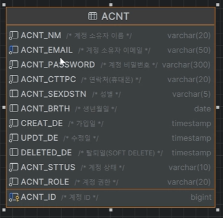

11/09
19:50

### 끝없는 로고

* 링크 찾아 넣고, 

### 세미 시스템 아키텍쳐

 #### Back

 * Back : 스프링 ? 스프링 부트
   * 스프링 부트는 스프링보다 더 효율적.
   * 백엔드 기술 선택은 큰 문제가 안될 것으로 예상됨.

   

 #### Front

 * Front : js, 리액트?
   * 리액트는 막혔을 때 맨땅에 헤딩? 도움을 받기가 어려움.
   * 리액트 구조를 짜는게 jsp와 다름.
   * 클론코딩을 하는게 쉽지 않음.
   * jsp와 리액트 웹연결은 http 통신할 때 비슷하다.
   * 백엔드 상황과는 다르게 리액트를 하려면 소모되는 비용이 많음.
   * 타입스크립트의 db 연결? axios 사용.
   * 팀 결정으로 인해 -> 선택과 집중을 함으로써 -> 수업을 내려놓고 할 때 개인적인 손실이 클 수 있다.
   * 기존 프론트 스터디는 유익함. 
   * 컴포넌트 흉내내듯이 하는 정도로만?

 * 공통
    * 비전공자에게는 공부량이 부담될 수 밖에 없음.
    * 지금 반 분위기 분위기 험악. -> 하지만 개인과 우리의 발전이 더 중요.
    * 결정 후 통보보다는 선생님께 물어보는 것으로.
    * ncp가 늦춰지면서 세미프로젝트가 당겨짐. 시간 부족.
    * 2주 정도 미리 세미의 세미프로젝트를 해서 선생님께 어필해보는 방법 ?

 * 의견1
   * jsp를 하면 유지보수를 하는 기업에 들어 갈 수 있는 장점?
   * 팀에서 리액트로 결정이 나면 선택과 집중을 하겠다. 
   * 감이 잘 안잡힘..

 * 의견2
   * 시간이 많이 필요하겠지만, jsp로 해서 리액트로 조금씩 옮겨보는 것?
   * 현재 프론트 스터디가 굉장히 유익함. 계속 진행하는 것이 좋을 것으로.

 * db jpa 까지는 세미때는 감당 불가, 학원에서는 마이바티스.
   * 단, 나중에 면접시 기술스택이 바뀌면 질문에 대한 설명을 잘 할 줄 알아야 함.

 * 결론 
   * jpa, 마이바티스에 대해 조사해오기 - 모든 파트가 (슬랙에 링크 있음)
   * 이번주는 - 백 : 스프링부트,  프론트 : 리액트 따로 스터디 해보기.
     * 한주간만 스터디 백 따로 스터디 해보는 방식. 다음 회의 때. 피드백.
   * 매일 1시간씩. 모여서. 스터디 후 식사.
     * 우선 DB. 짝꿍과 엔터티
   * 내부적으로는 리액트와 부트로 결정.
    

---

* 스터디
   * 대략적인 테마를 정해 중간 점검하는 형식으로?
   * 팀스터디를 날짜를 월수금 정해서?
   * 현재 프론트 백 나뉜것은 세미때뿐이므로 스터디는 공통으로 해보는 것으로 (본 과정은 풀스택과정임도)
   * 현재 수업 + 복습량이 만만치 않은데 스터디까지 감당?
     * 방안 :  매일 1시간씩 같은 주제로 집중해서 실습 해보는 방식.
   * 현재 각 파트에서 서로간의 공유가 되도록 정리한 것을 공부해보기로.> 각자의 파트에 좀 더 집중할 수 있음.
     * 백은 스프링, 프론트는 리액트.
   * 같이 모여서 노마드 수업을 같이 들으면서 따라하는 방식 등.
  

* DB 설계
  * DB 네이밍 컨벤션
    1. 접두어 여부 ? 접두어 넣는 것으로 
    2. 대문자 소문자 ? 대문자 (쓰기는 불편해도 보기에는 현함)
    3. 약어 ? 풀네임? > 약어 (표준 약어 엑셀 이용)
    4. 코멘트는 필수

  

    
 * 기타 
   * 보수적인 곳은 스프링 없이 순수 자바.
   * 오래된 기술을 쓰는 사람이 없어 오히려 연봉이 높다?
   
 * jpa 
   * 구현이 단순한 편.
   * 우테코 누군가가에서 강력하게 추천
   * 마이바티스. > jsp,.. html. 최신트랜드가 아닌 느낌
   * jpa는 최신트랜드 느낌. 
   * 간단한거 찾을 떄? 복잡한거는 직접 사용.

   

   
    

### 기타

#### 본인 깃허브 꾸미기
  * 본인 깃 허브 기술 스택에 쓸만한 gif (참고 URL 보기)
  * 소스코드 통계치
  * 등급

